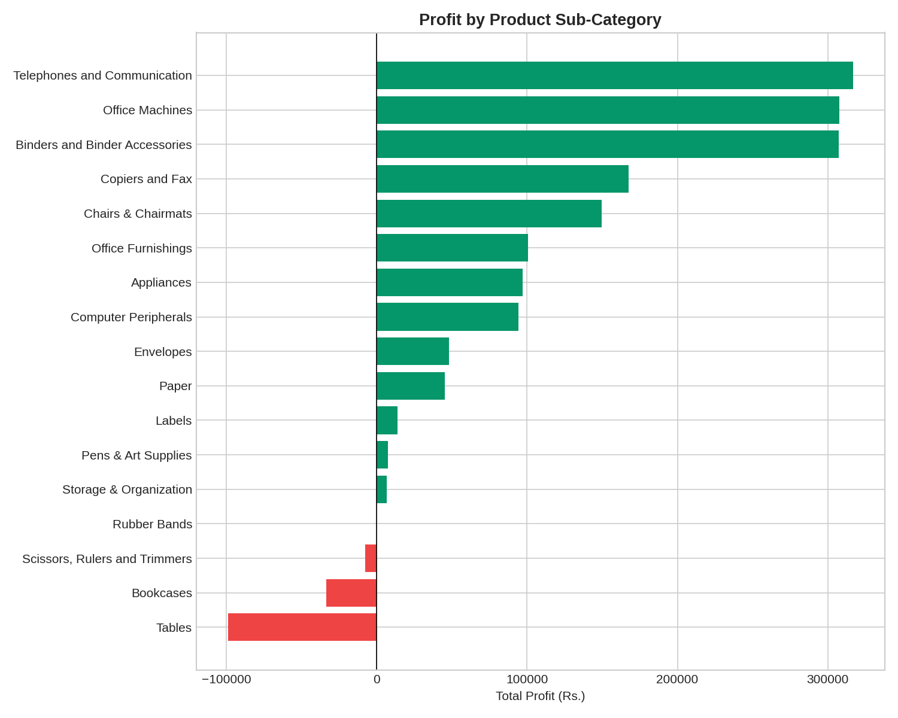
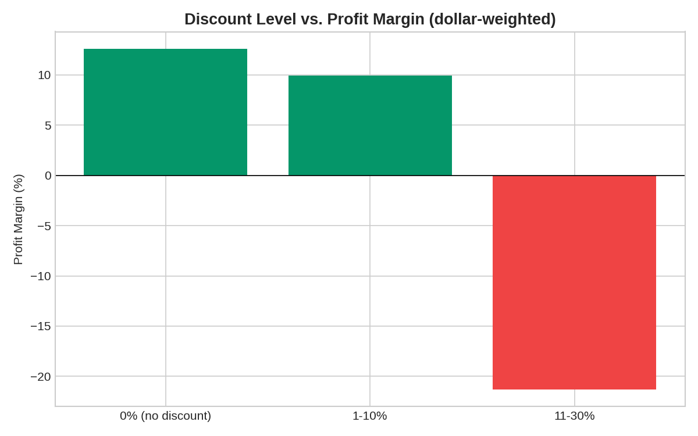
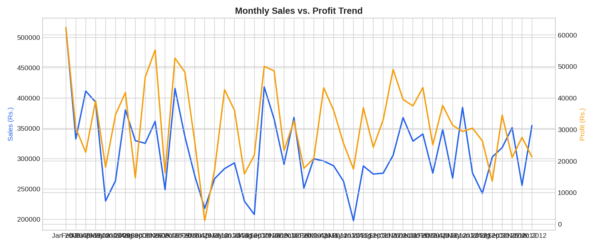
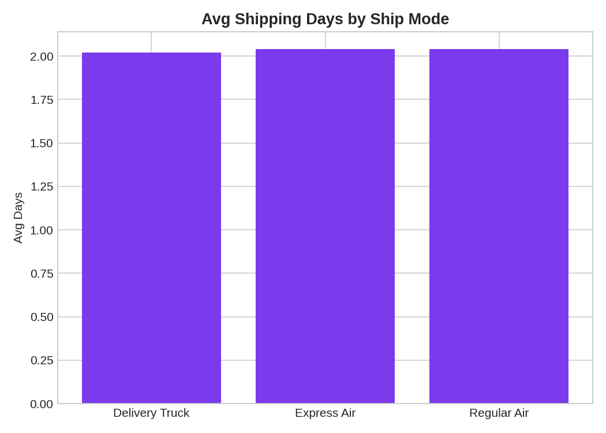
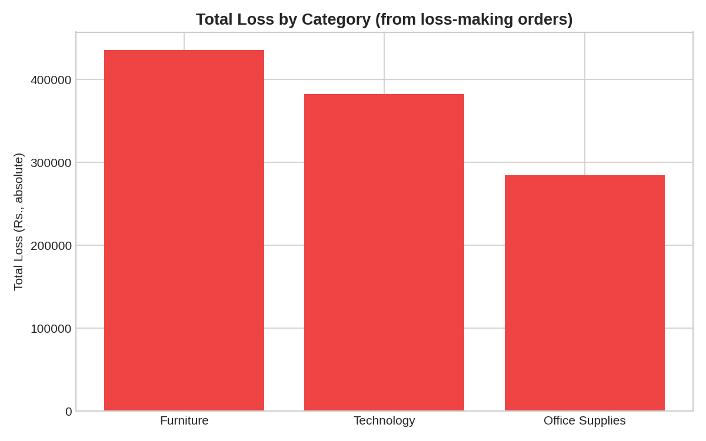
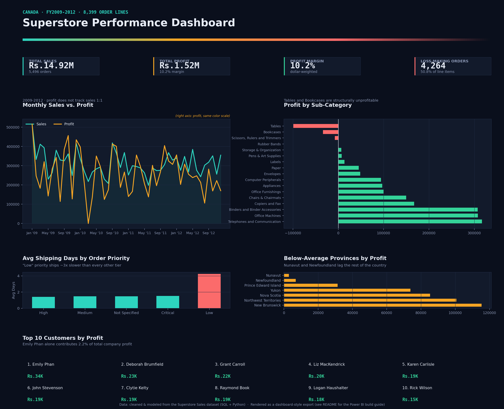

# Superstore Sales & Profitability Analysis

> **End-to-end retail analytics project using SQL, Python, and Power BI to uncover the drivers of sales, profitability, discounting, shipping performance, and customer value.**

**Raw Data → Data Cleaning → Star Schema → SQL Analysis → Python Visualization → Interactive Dashboard → Power BI**

This project uses a real historical Superstore retail dataset and demonstrates a complete analytics workflow from raw transactional data to business insights and dashboard-ready reporting.

## 🔗 Project Links

- 🌐 **[Live Interactive Dashboard](https://shubhamkjha-3267.github.io/superstore-analysis/)**
- 📁 **[GitHub Repository](https://github.com/shubhamkjha-3267/superstore-analysis)**
- 🧮 **[SQL Analysis](sql/01_analysis_queries.sql)**
- 📖 **[Power BI Build Guide](powerbi_guide/POWERBI_GUIDE.md)**
- 📊 **Power BI-ready data model:** `data/powerbi/`

---

## 🎯 Business Problem

A Canadian office-supplies retailer wants to understand:

> **Where is the company actually making money, and where is it quietly losing it?**

Sales volume alone can be misleading. A product can generate strong revenue while producing little profit—or even losing money.

This project analyzes:

- Sales performance
- Profitability
- Discounting behavior
- Shipping performance
- Customer value
- Regional performance
- Product and category performance

The objective is to turn transactional data into **actionable business insights**, rather than simply reporting sales totals.

---

## 📊 Dataset

The project uses a **real historical retail dataset**, not synthetic data.

| Metric | Value |
|---|---:|
| Order line items | 8,399 |
| Orders | 5,496 |
| Time period | 2009–2012 |
| Original columns | 21 |
| Data type | Retail transactions |

Key fields include:

`Sales` · `Profit` · `Discount` · `Shipping Cost` · `Order Priority` · `Product Base Margin` · `Customer` · `Product` · `Region` · `Order Date` · `Ship Date`

### Data Quality

The raw data contains real-world issues, including:

- 63 missing `Product Base Margin` values
- Encoding issues
- Date validation requirements
- Dimensional values requiring normalization

### Source

[Superstore Sales Dataset](https://raw.githubusercontent.com/curran/data/gh-pages/superstoreSales/superstoreSales.csv)

---

## 🛠️ Tools & Why

| Tool | Role |
|---|---|
| **Python / Pandas** | Data cleaning, transformation, and star-schema modeling |
| **SQL / SQLite** | Eight business-question analyses using joins, CTEs, subqueries, and window functions |
| **Matplotlib** | Static analytical charts |
| **Power BI / DAX** | Interactive dashboard, KPIs, and business reporting |
| **HTML / CSS / JavaScript** | Browser-based interactive dashboard |
| **Git / GitHub** | Version control and project documentation |

---

## 🔄 Approach

1. **Clean & model** — `scripts/clean_and_model.py`
   - Parse and validate dates
   - Ensure ship dates do not precede order dates
   - Impute 63 missing `product_base_margin` values using the category median
   - Build a proper star schema:
     `fact_sales` + `dim_customer` + `dim_product` + `dim_region` + `dim_date`

2. **Analyze in SQL** — `sql/01_analysis_queries.sql`
   - Run eight business questions against the star schema in SQLite
   - Use joins, CTEs, subqueries, aggregations, and window functions

3. **Visualize in Python**
   - Generate static charts for the README and portfolio

4. **Build for Power BI**
   - Use the same star schema for Power BI
   - Apply DAX measures and dashboard design recommendations from the build guide

5. **Interactive web dashboard**
   - `dashboard/index.html`
   - Provides a browser-based view of the core KPIs and analysis
   - Hosted through GitHub Pages

---

# 💡 Key Findings

### 1. Half of Order Lines Lose Money

**4,264 of 8,399 order lines (50.8%) have negative profit**, even though the company remains profitable overall with approximately a **10.2% margin**.

**Insight:** Losses are concentrated rather than evenly distributed, making product, category, customer, and regional investigation more useful than treating profitability as a company-wide problem.

### 2. Furniture Is the Biggest Profitability Problem

| Product | Profit |
|---|---:|
| Tables | **-₹99K** |
| Bookcases | **-₹34K** |

Meanwhile, **Telephones, Office Machines, and Binders** each generate **₹300K+ in profit**.

**Insight:** Furniture is a clear candidate for a deeper review of pricing, discounting, product costs, shipping costs, and supplier economics.

### 3. Deep Discounts Can Destroy Margin

Orders discounted **0–10%** maintain approximately **10–13% margins**, while the **11–30% discount** group falls to approximately **-21.3% margin**.

This is a **dollar-weighted metric**, rather than a naive average of row-level percentages.

**Insight:** Discounting may increase sales volume without creating proportional profit.

### 4. Low-Priority Orders Ship Much Slower

Low-priority orders average approximately **4.24 days**, compared with approximately **1.5 days** for the other priority levels.

The difference is consistent across all three shipping modes.

**Insight:** The pattern suggests a potential internal prioritization or queue-management issue rather than simply a carrier problem.

### 5. Regional Profitability Is Uneven

**Nunavut and Newfoundland** trail other provinces in profitability.

Potential factors worth investigating include:

- Shipping costs
- Order volume
- Product mix
- Regional demand
- Pricing
- Logistics

This is a follow-up hypothesis, not a claim that geography itself causes the lower profitability.

---

# 📈 Visual Analysis

The Python pipeline generates static analytical charts.

| Profit by Sub-Category | Discount vs Margin |
|---|---|
|  |  |

| Monthly Sales & Profit Trend | Shipping Days by Mode |
|---|---|
|  |  |

| Losses by Category | Power BI Dashboard |
|---|---|
|  |  |

---

# 📊 Power BI Dashboard

The Power BI model is built around the same star schema used for the SQL analysis.

### Model

```text
                    fact_sales
                        │
        ┌───────────────┼───────────────┐
        │               │               │
        ▼               ▼               ▼
 dim_customer    dim_product      dim_region
                        │
                        ▼
                    dim_date
```

Power BI-ready tables are located in:

```text
data/powerbi/
```

The build guide covers:

- Data import
- Table relationships
- DAX measures
- KPI design
- Dashboard layout
- Visualization recommendations

See:

**[`powerbi_guide/POWERBI_GUIDE.md`](powerbi_guide/POWERBI_GUIDE.md)**

### Dashboard


> The repository includes the Power BI-ready data model and dashboard guide. The live browser dashboard is available below.

---

# 🌐 Interactive Dashboard

## 🚀 [View the Live Superstore Dashboard](https://shubhamkjha-3267.github.io/superstore-analysis/)

A browser-based interactive dashboard is included in:

```text
dashboard/index.html
```

It provides a lightweight way to explore the project's core metrics without requiring Power BI Desktop.

### Dashboard includes

- Sales KPIs
- Profit KPIs
- Profit margin
- Sales trends
- Product performance
- Regional performance
- Customer insights
- Profitability analysis

### Run locally

Open:

```text
dashboard/index.html
```

in a browser.

Or use the hosted version:

**https://shubhamkjha-3267.github.io/superstore-analysis/**

---

# 📁 Project Structure

```text
superstore-analysis/
│
├── data/
│   ├── raw/                    # Original dataset
│   ├── clean/                  # Cleaned data
│   ├── powerbi/                # Power BI star-schema tables
│   └── results/                # SQL query results
│
├── sql/
│   └── 01_analysis_queries.sql
│
├── scripts/
│   ├── clean_and_model.py      # Raw → clean → star schema
│   └── run_sql_analysis.py     # SQLite → SQL analysis → charts
│
├── powerbi_guide/
│   └── POWERBI_GUIDE.md        # Relationships, DAX, dashboard design
│
├── dashboard/
│   └── index.html              # Interactive web dashboard
│
├── visuals/
│   ├── profit_by_subcategory.png
│   ├── discount_vs_margin.png
│   ├── monthly_sales_profit_trend.png
│   ├── shipping_days_by_mode.png
│   ├── losses_by_category.png
│   └── superstore_dashboard.png
│
└── README.md
```

---

# ▶️ How to Run

### 1. Clone the repository

```bash
git clone https://github.com/shubhamkjha-3267/superstore-analysis.git
cd superstore-analysis
```

### 2. Install dependencies

```bash
pip install pandas numpy matplotlib
```

### 3. Clean and build the data model

```bash
python3 scripts/clean_and_model.py
```

This creates the cleaned dataset and star-schema tables.

### 4. Run the SQL analysis

```bash
python3 scripts/run_sql_analysis.py
```

This:

- Loads the star schema into SQLite
- Executes all eight business questions
- Saves query results
- Generates the visualization outputs

### 5. Open the dashboard

```text
dashboard/index.html
```

Or visit the live dashboard:

**https://shubhamkjha-3267.github.io/superstore-analysis/**

---

# 🧠 SQL Concepts Demonstrated

- Star-schema joins
- Multi-table `JOIN`s
- `GROUP BY`
- `HAVING`
- CTEs
- Nested subqueries
- Window functions
- `RANK()`
- `NTILE()`
- Conditional aggregation
- Date-based analysis
- Customer value quartiles
- Profitability analysis
- Dollar-weighted vs. naive-average aggregation

---

# 🎯 Skills Demonstrated

**Data Analytics**
- Business problem solving
- KPI analysis
- Profitability analysis
- Customer analysis
- Product analysis
- Regional analysis
- Data-driven recommendations

**SQL**
- Complex joins
- CTEs
- Subqueries
- Aggregations
- Window functions
- SQLite

**Python**
- Pandas
- NumPy
- Matplotlib
- Data cleaning
- Data transformation
- Analytical pipelines

**Power BI**
- Star-schema modeling
- DAX
- KPI design
- Interactive dashboards
- Business reporting

---

# 🚀 Possible Next Steps

- Rebuild the pipeline against PostgreSQL
- Add `Sales YoY %` time intelligence in Power BI
- Add customer cohort analysis
- Build RFM customer segmentation
- Investigate furniture losses using a deeper cost/margin breakdown
- Add shipping-cost optimization analysis
- Expand the interactive dashboard with additional filters
- Automate dashboard data refresh

---

## 👤 Author

**Shubham Jha**

**Data Analyst | Aspiring Data Scientist**

Interested in **Data Analytics, Business Intelligence, Data Science, and Python-based analytical roles**.

---

⭐ **If you found this project useful, feel free to explore the SQL analysis, Python pipeline, Power BI model, and interactive dashboard.**
